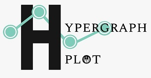

# hypergraphs-plot

A js library to visualize hypergraphs.


| **Documentation** | **Build Status** |
|---------------|--------------|
|... | [![Build Status][travis-img]][travis-url]  [![Coverage Status][codecov-img]][codecov-url] <br/> Linux and macOS |

[docs-dev-url]: https://pszufe.github.io/SimpleHypergraphs.jl/dev
[docs-stable-url]: https://pszufe.github.io/SimpleHypergraphs.jl/stable

[travis-img]: https://travis-ci.org/isislab-unisa/hypergraphs-plot.svg?branch=master
[travis-url]: https://travis-ci.org/isislab-unisa/hypergraphs-plot

[codecov-img]: https://coveralls.io/repos/github/isislab-unisa/hypergraphs-plot/badge.svg?branch=master
[codecov-url]: https://coveralls.io/github/isislab-unisa/hypergraphs-plot?branch=master


##Installing
Install the latest version of hypergraphs-plot with NPM

```
npm install https://github.com/isislab-unisa/hypergraphs-plot.git
```

Otherwise, download the [latest release](https://github.com/isislab-unisa/hypergraphs-plot/blob/master/bundle.v1.0.js).

###Usage


